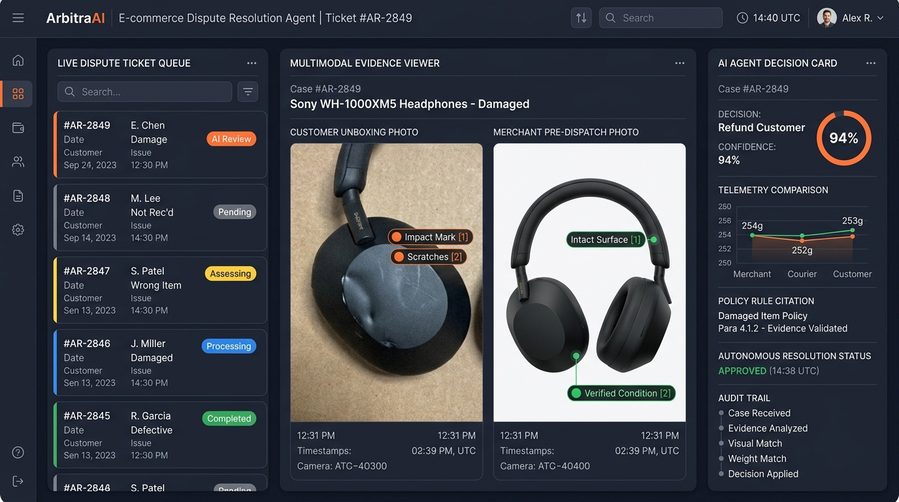

# Project ArbitraAI: Autonomous Multimodal Dispute and Fraud Resolution Agent



---

## 1. Google Form Submission Text

### What do you want to build?

#### 1. Stakeholder: Who is this for?
Solusi ini ditujukan untuk dua pemangku kepentingan utama dalam ekosistem e-commerce dan logistik digital Indonesia (khususnya platform seperti Shopee dan jaringan kurir SPX Express):
- Operations & Dispute Resolution Team: Agen operasional internal dan investigator fraud yang setiap hari harus memproses ribuan tiket sengketa pengembalian barang dan dana (return/refund disputes).
- Penjual Terverifikasi (Merchants/MSMEs): Penjual yang kerap dirugikan oleh klaim fiktif pembeli (seperti klaim paket rusak palsu, barang ditukar, atau sengketa Cash on Delivery/COD) dan harus menunggu hingga 7 hari kerja untuk penyelesaian dana.

#### 2. Challenge: What problem are they facing?
Proses sengketa pengembalian barang di e-commerce Indonesia saat ini masih sangat manual, lambat, dan rentan eksploitasi fraud:
- Volume Tinggi dan Waktu Penyelesaian Lama: Tim investigasi manusia membutuhkan waktu 15 hingga 30 menit per kasus untuk memeriksa silang bukti foto unboxing, rekaman video, log berat timbangan kurir, dan riwayat pesanan. Akibatnya, backlog tiket menumpuk dan waktu resolusi memakan waktu 3 hingga 7 hari kerja.
- Kerugian Finansial Akibat Fraud Canggih: Pola penipuan pengembalian barang semakin marak, mulai dari pengembalian paket kosong, manipulasi foto kerusakan produk menggunakan gambar dari internet, hingga penukaran produk asli dengan barang tiruan sebelum dikembalikan ke penjual.
- Gesekan Ekosistem: Penjual frustrasi karena perputaran modal tertahan dan risiko barang hilang, sementara pembeli jujur merasa frustrasi karena proses pencairan pengembalian dana yang berbelit-belit.

#### 3. Result: What outcome do you want for the stakeholders?
- Penurunan Waktu Resolusi (SLA): Memangkas rata-rata waktu resolusi sengketa dari 3-7 hari menjadi di bawah 60 detik untuk kasus-kasus berisiko rendah hingga menengah secara otonom.
- Otomasi Operasional 70%+: Mengotomatiskan keputusan sengketa hingga 70% dari total tiket masuk tanpa memerlukan intervensi manusia, sehingga tim operasional hanya menangani 30% kasus anomali berisiko tinggi.
- Reduksi Kerugian Finansial (Fraud Leakage): Mendeteksi manipulasi bukti visual dan inkonsistensi data logistik dengan akurasi tinggi, melindungi modal penjual UMKM dan meminimalkan beban operasional platform.
- Keputusan yang Transparan dan Dapat Diaudit (Explainable Adjudication): Memberikan ringkasan keputusan terstruktur disertai referensi bukti digital, kutipan pasal kebijakan platform, dan estimasi skor keyakinan untuk setiap pihak yang bersengketa.

#### 4. Approach: How will you build the solution? (method, tech, scope)
- Method:
  Membangun sistem agen otonom berbasis penalaran multimodal (Multimodal Autonomous Adjudication Agent) dengan arsitektur Verification-Reasoning-Action. Agen mengekstraksi frame bukti unboxing, memverifikasi metadata visual dengan spesifikasi SKU dan foto prapengiriman penjual, melakukan kueri riwayat transaksi dan log timbangan transit kurir melalui tool calling, lalu menerbitkan putusan terstruktur dengan batas pengaman finansial (guardrails).
- Technology Stack:
  - Model & AI Engine: OpenAI API (GPT-4o / OpenAI Codex) memanfaatkan Multimodal Vision, Structured Outputs (strict JSON Schema), dan Function Calling / Tool Calling.
  - Backend Orchestration: Python (FastAPI) dengan engine state machine untuk mengelola alur verifikasi bukti, kalkulasi skor anomali, dan penegakan batas wewenang persetujuan dana.
  - Frontend Interface: React / Vite dengan Vanilla CSS dan Tailwind CSS modern untuk menyediakan Dashboard Monitoring Investigasi Operasional dan Portal Bukti Interaktif.
  - Data Mocking & Vector Store: In-memory vector index untuk pencarian semantik terhadap basis data kebijakan sengketa (Policy Knowledge Base) serta repositori mock data logistik SPX dan riwayat profil pembeli/penjual.
- Scope (7-Hour Hackathon Build):
  - Mengembangkan antarmuka operasi live yang menampilkan aliran tiket sengketa baru secara real-time.
  - Mengimplementasikan pipeline analisis bukti multimodal untuk mendeteksi kecocokan kerusakan produk, manipulasi visual, dan verifikasi label resi pengiriman.
  - Membangun 3 tool integrations fungsional: Mock Logistic Weight Verifier API, Buyer/Seller Trust Score API, dan Platform Policy Rule Engine.
  - Menyediakan 15 skenario kasus uji realistis (klaim kerusakan valid, klaim manipulasi paket kosong, klaim penukaran produk, dan kasus ambigu yang membutuhkan eskalasi manusia).
  - Menampilkan live audit trail yang menunjukkan alasan penalaran agen sebelum aksi pengembalian dana atau penolakan dieksekusi.

---

## 2. Pemetaan Penggunaan AI: Di Mana AI Digunakan dan Mengapa?

Dalam sistem ArbitraAI, kecerdasan buatan tidak digunakan sebagai pembungkus percakapan (chatbot wrapper), melainkan sebagai mesin penalaran, ekstraksi data multimodal, dan pengambil keputusan otonom yang terisolasi dengan guardrails ketat:

| Komponen Sistem | Teknologi AI yang Digunakan | Peran dan Tanggung Jawab Spesifik |
| :--- | :--- | :--- |
| Multimodal Evidence Extractor | OpenAI Vision (GPT-4o) | Mengekstraksi kondisi fisik produk dari foto/video unboxing pembeli dan membandingkannya dengan foto pra-pengiriman penjual. Mendeteksi cacat fisik, sobekan kemasan, dan nomor seri/label resi. |
| Evidence Authenticity Inspector | OpenAI Vision + Heuristik Visual | Memeriksa integritas segel kemasan (tamper-evident tape) dan mendeteksi anomali visual seperti gambar hasil rekayasa, foto layar sekunder (display capture), atau foto katalog unduhan web. |
| Autonomous Investigation Loop | OpenAI Function Calling / Tool Use | Menentukan tool deterministik apa yang wajib dipanggil secara independen untuk memverifikasi fakta di luar gambar, seperti menarik log berat timbangan kurir dan rekam jejak akun. |
| Policy Compliance Matcher | OpenAI Embeddings (text-embedding-3-small) | Mengambil klausul pasal spesifik dari basis data aturan platform (Shopee Guarantee Terms, Aturan Klaim Kerusakan Logistik, Kebijakan Penjual) secara semantik. |
| Structured Adjudication Engine | OpenAI Structured Outputs (Strict JSON) | Mengonsolidasikan semua bukti, skor deviasi timbangan, dan aturan kebijakan menjadi satu format keputusan terstruktur yang menjamin nol halusinasi format. |

---

## 3. Alur Mekanisme Kerja Sistem (Step-by-Step Flow)

```mermaid
sequenceDiagram
    autonumber
    actor Customer as Pembeli / Penjual
    participant Portal as Ingestion Webhook / UI
    participant Agent as ArbitraAI Orchestrator
    participant Vision as OpenAI Vision Engine
    participant Tools as Logistics & Abuse APIs
    participant Policy as Policy Vector Base
    participant Gate as Guardrail & Action Executor
    actor Ops as Human Investigator

    Customer->>Portal: Mengunggah bukti klaim (Foto unboxing, resi, keterangan)
    Portal->>Agent: Memicu event tiket sengketa baru (Dispute Event)
    
    rect rgb(20, 30, 45)
    note right of Agent: Tahap 1: Ekstraksi Bukti Multimodal
    Agent->>Vision: Kirimkan foto unboxing pembeli & foto prapengiriman penjual
    Vision-->>Agent: Output fitur: Indeks kerusakan, integritas segel, teks resi
    end

    rect rgb(25, 35, 50)
    note right of Agent: Tahap 2: Grounding Data Deterministik (Tool Calling)
    Agent->>Tools: verify_shipping_weight(tracking_id)
    Tools-->>Agent: Data timbangan: Origin Hub = 420g, Dest Hub = 418g
    Agent->>Tools: fetch_user_abuse_profile(user_id)
    Tools-->>Agent: Skor risiko akun: Trust Score = 96%, Return Rate = 2%
    Agent->>Policy: match_policy(defect_category="Damaged Goods")
    Policy-->>Agent: Klausul Kebijakan Klausul 4.1.2 - Tanggung Jawab Transit Kurir
    end

    rect rgb(30, 40, 55)
    note right of Agent: Tahap 3: Sintesis Putusan & Guardrail
    Agent->>Agent: Evaluasi matriks bukti & kalkulasi confidence score (94%)
    alt Confidence >= 90% dan Nilai Klaim <= Batas Wewenang
        Agent->>Gate: Eksekusi otomatis: Refund disetujui, dana logistik diklaim
        Gate-->>Customer: Notifikasi instan & pencairan dana otonom (< 60 detik)
    else Kasus Ambigu / Nilai Klaim Tinggi / Confidence < 90%
        Agent->>Ops: Alihkan ke Human-in-the-Loop lengkap dengan rekomendasi AI
        Ops->>Gate: Verifikasi satu klik oleh investigator manusia
        Gate-->>Customer: Notifikasi hasil investigasi resmi
    end
    end
```



---

## 4. Mekanisme Teknis Detail

### 4.1. Tahap Ingesti dan Ekstraksi Bukti Visual
1. Pembeli mengajukan klaim pengembalian dana melalui portal dengan melampirkan foto barang rusak dan nomor resi pengiriman.
2. Backend secara otomatis mengambil foto arsip prapengiriman (pre-dispatch snapshot) yang diunggah penjual saat mencetak resi.
3. OpenAI Vision membandingkan kedua gambar secara berdampingan:
   - Mencocokkan apakah SKU produk pada unboxing identik dengan barang yang dikirim.
   - Mengidentifikasi lokasi dan jenis kerusakan (misal: panel retak akibat tekanan vs goresan bawaan pabrik).
   - Memeriksa keberadaan label resi resmi SPX Express pada kemasan yang difoto.

### 4.2. Tahap Verifikasi Deterministik Melalui Function Calling
Agen tidak mengambil keputusan hanya berdasarkan persepsi visual. Agen mengeksekusi tiga tool terprogram:
- `verify_shipping_weight`: Memverifikasi bobot paket saat pertama kali masuk ke sortir hub kurir dibandingkan bobot saat diterima kurir pengantar terakhir. Jika terjadi penurunan bobot drastis (misal dari 500 gram menjadi 60 gram), indikasi pencurian/paket kosong terkonfirmasi pada fase transit.
- `fetch_user_abuse_profile`: Memeriksa riwayat rasio klaim retur akun pembeli. Pola klaim berulang setiap transaksi bernilai tinggi akan menaikkan skor anomali akun.
- `verify_seller_compliance`: Memeriksa histori ketepatan pengemasan standar penjual (kepatuhan proteksi bubble wrap dan stiker fragile).

### 4.3. Format Output Terstruktur (Strict JSON Schema)
Agen diwajibkan menghasilkan output strictly typed untuk memastikan integrasi langsung dengan modul pembayaran dan log audit:

```json
{
  "ticket_id": "AR-2849",
  "dispute_summary": "Kerusakan fisik panel Sony WH-1000XM5 saat transit logistik",
  "evidence_analysis": {
    "visual_match_confirmed": true,
    "damage_detected": "Cracked headband surface consistent with impact",
    "pre_dispatch_verified_intact": true,
    "weight_discrepancy_grams": 2.0
  },
  "tool_verification_results": {
    "courier_weight_status": "NORMAL_TOLERANCE",
    "buyer_risk_score": 0.04,
    "seller_compliance_verified": true
  },
  "policy_citation": "Shopee Guarantee Logistics Damage Policy Clause 4.1.2",
  "decision": "REFUND_BUYER_AND_COMPENSATE_SELLER",
  "confidence_score": 0.94,
  "liability_split": {
    "buyer_refund_percentage": 100,
    "seller_deduction_percentage": 0,
    "platform_logistics_pool_percentage": 100
  },
  "execution_mode": "AUTONOMOUS",
  "audit_trail": [
    "Bukti kerusakan visual tervalidasi dengan foto prapengiriman utuh",
    "Log timbangan transit konsisten menunjukkan paket tidak kosong saat transit",
    "Skor kepercayaan kedua pihak tinggi di atas 90%",
    "Putusan otomatis dieksekusi berdasarkan klausul asuransi kurir platform"
  ]
}
```

### 4.4. Lapisan Keamanan dan Guardrails Finansial
- Threshold Otonom: Putusan otonom instan hanya dieksekusi jika `confidence_score >= 0.90` dan nilai transaksi di bawah pagu risiko standar (misal: Rp 500.000).
- Human Escalation: Untuk transaksi dengan nilai di atas batas atau tingkat keyakinan berada di bawah 90%, tiket masuk ke antarmuka Human-in-the-Loop. Agen menyajikan ringkasan pra-analisis komparatif, sehingga investigator manusia hanya butuh 10 detik untuk meninjau dan mengeklik tombol konfirmasi.

---

## 5. Matriks Fitur Prototipe Hackathon

| Modul | Fitur | Status Target 7 Jam |
| :--- | :--- | :--- |
| Portal Bukti | Pengunggahan bukti visual komparatif (pembeli & penjual) | Siap diuji coba |
| Vision Inspector | Ekstraksi kerusakan dan verifikasi segel via OpenAI Vision | Fungsional penuh |
| Tool Integrations | 3 Mock API: Hub Weight, User Abuse Score, Policy Base | Fungsional penuh |
| Adjudication Core | Sintesis bukti dan output JSON terstruktur deterministik | Fungsional penuh |
| Operations Console | Dashboard investigasi real-time dengan status tiket dan audit trail | Fungsional penuh |
| Governance Guardrail | Aturan pembatasan nominal dan eskalasi Human-in-the-Loop | Fungsional penuh |

---

## 6. Skenario Uji Coba Langsung di Depan Juri (Live Pitch Demo)

Dalam sesi demo berdurasi 3 menit di depan dewan juri, prototipe akan mendemonstrasikan 3 kasus interaktif:

### Kasus 1: Modus Penipuan Paket Kosong (Empty Box Fraud)
- Pembeli mengajukan klaim bahwa isi paket smartphone kosong dan meminta pengembalian dana Rp 4.500.000.
- Eksekusi Agen: Tool `verify_shipping_weight` mendeteksi bahwa bobot paket tetap 420 gram hingga serah terima di tangan penerima. Agen langsung menolak klaim secara otonom dengan bukti bobot logistik, menyelamatkan dana penjual.

### Kasus 2: Kerusakan Transit Sah (Legitimate Courier Damage)
- Pembeli menerima headphone dengan rangka retak, melampirkan video unboxing yang memperlihatkan kotak luar penyok.
- Eksekusi Agen: Agen memverifikasi kerusakan pada foto pembeli, memastikan foto penjual sebelum kirim dalam keadaan sempurna, dan mencatat bobot konsisten. Agen mengeksekusi pengembalian dana 100% ke pembeli sekaligus mengganti kerugian penjual lewat asuransi logistik dalam 15 detik.

### Kasus 3: Kasus Ambigu dengan Eskalasi Cepat (Human-in-the-Loop)
- Klaim sengketa barang tiruan dengan foto minim pencahayaan dan klaim yang bertolak belakang.
- Eksekusi Agen: Karena tingkat keyakinan hanya 71%, sistem menolak eksekusi otomatis dan menampilkan kartu kasus siap tinjau pada dashboard investigator manusia lengkap dengan opsi keputusan satu klik.

---

## 7. Potensi Kendala Teknis dan Mitigasi Sistem

Membangun sistem adjudikasi sengketa berbasis agen otonom melibatkan sejumlah tantangan teknis nyata. Berikut adalah kendala utama beserta mitigasi arsitekturalnya:

| Kendala / Tantangan | Resiko Operasional | Solusi & Mitigasi Teknis |
| :--- | :--- | :--- |
| Rekayasa Bukti Gambar (Visual Fraud & Generative AI) | Pembeli nakal mengunggah foto rekayasa AI, foto editan Canva, atau foto dari ulasan orang lain untuk mengklaim barang rusak. | 1. Implementasi perceptual hashing (pHash) untuk mendeteksi kesamaan gambar dengan database ulasan publik.<br>2. Verifikasi fisik independen: model tidak hanya percaya foto, tetapi memverifikasi telemetri timbangan logistik dan histori akun yang tidak dapat dimanipulasi dari sisi klien. |
| Latensi & Biaya Pemrosesan Berkas Video Unboxing | Mengirimkan video mentah berdurasi 1-3 menit langsung ke LLM multimodal memakan token sangat besar dan menghasilkan latensi hingga 45 detik. | Frame Sampler Pre-processing: Sistem mengekstrak 3-5 frame penting secara terprogram (frame saat segel pertama dibuka, frame saat produk dikeluarkan, dan frame tampilan cacat fisik), memangkas waktu inferensi menjadi di bawah 4 detik. |
| Dilema False Positive vs False Negative | Salah menolak pembeli jujur merusak reputasi platform; salah menyetujui klaim fiktif menimbulkan kebocoran finansial (*financial leakage*). | Asymmetric Confidence Threshold: Putusan penolakan klaim (Rejection) membutuhkan skor keyakinan lebih tinggi (>= 95%) atau wajib konfirmasi manusia, sedangkan persetujuan refund nilai kecil diberi toleransi kecepatan tinggi dengan proteksi pagu maksimal. |
| Akun Baru Tanpa Riwayat (Cold Start Problem) | Pembeli atau penjual baru belum memiliki data reputasi atau rekam jejak retur di platform. | Fallback ke Device Fingerprint & Baseline Cluster: Akun baru otomatis diposisikan pada status 'Neutral Verification', di mana validasi berfokus murni pada bukti fisik logistik (berat dan segel) tanpa asumsi reputasi. |

---

## 8. Kebutuhan Data, Kredibilitas, dan Tata Kelola (Data Governance)

### 8.1. Apakah Diperlukan Data Sangat Banyak?
Tidak. Kredibilitas sistem ini **tidak bergantung pada pelatihan model machine learning dari awal (pre-training/fine-tuning) yang membutuhkan gigabyte data**. Sistem ini beroperasi menggunakan prinsip **Deterministic Grounded Agent**:
- Model LLM (GPT-4o) berperan sebagai mesin penalaran multimodal tingkat tinggi.
- Kredibilitas keputusan dijamin oleh validasi silang data internal marketplace yang sudah tersedia di infrastruktur Shopee dan SPX Express.

### 8.2. Empat Pilar Data yang Diperlukan
Untuk memastikan setiap keputusan bersifat faktual dan dapat dipertanggungjawabkan:
1. Log Telemetri Timbangan Hub SPX (Weight Telemetry):
   - Catatan berat timbangan otomatis di hub asal, hub transit, dan hub kurir pengantar (toleransi error standar kurir: +- 5 gram).
2. Snapshot Pra-Pengiriman Penjual (Merchant Pre-Dispatch Archive):
   - Foto kondisi barang dan label resi yang diunggah penjual saat mencetak dokumen pengiriman (SOP Star Seller / Shopee Mall).
3. Matriks Risiko Entitas (Buyer & Seller Risk Vector):
   - Rasio pengajuan retur 90 hari terakhir, frekuensi sengketa per total transaksi, dan deteksi anomali perangkat.
4. Spesifikasi SKU Standar Pabrikan (Catalog Benchmark):
   - Berat baku dan dimensi kemasan resmi dari produsen untuk mendeteksi deviasi bobot.

### 8.3. Tata Kelola Data (Data Governance) dan Kepatuhan Regulasi
Implementasi sistem tunduk pada standar privasi dan tata kelola data perusahaan:
- Kepatuhan UU Perlindungan Data Pribadi (UU PDP No. 27/2022):
  Sebelum gambar dan metadata dikirim ke pipeline inferensi model, modul PII Sanitizer secara otomatis menyamarkan nama lengkap, nomor telepon, dan alamat rumah yang tertera pada label resi.
- Kebijakan Kerahasiaan Data (OpenAI Enterprise Privacy):
  Menggunakan API tingkat korporat/komersial di mana data transaksi dan berkas gambar tidak digunakan untuk melatih model (*Zero Data Retention for training*).
- Audit Trail Imutabel & Hak Sanggah (Right to Explanation):
  Setiap keputusan agen menyimpan jejak penalaran terstruktur (JSON log) yang mencantumkan pasal dasar penolakan atau penerimaan, sehingga memenuhi standar audit OJK dan memberikan hak banding transparan bagi pengguna.

---

## 9. Pertanyaan Kritis Dewan Juri dan Strategi Jawaban (Judge Defense Strategy)

Berikut adalah daftar pertanyaan krusial yang diprediksi akan diajukan oleh juri teknis dan bisnis Sea x OpenAI beserta jawaban argumentatifnya:

### Pertanyaan 1: "Mengapa menggunakan AI Multimodal, bukan sistem aturan biasa (Rule-Based Engine) yang lebih murah dan pasti?"
- **Jawaban**: Sistem rule-based bekerja sangat baik untuk angka, tetapi gagal total dalam memproses dunia nyata. Rule-based tidak mampu melihat apakah layar ponsel retak karena benturan fisik saat pengiriman atau cacat bawaan pabrik, tidak bisa mengevaluasi apakah segel lakban pada video unboxing telah dibuka sebelumnya, dan tidak bisa membaca label resi yang miring atau buram. ArbitraAI menggabungkan kemampuan persepsi visual AI multimodal untuk memahami konteks tak terstruktur dengan ketegasan sistem deterministik (log timbangan dan aturan API) untuk eksekusinya.

### Pertanyaan 2: "Bagaimana jika ada sindikat penipuan yang menambahkan batu atau beban lain ke dalam kotak agar berat timbangan tetap sama?"
- **Jawaban**: Di sinilah kekuatan verifikasi multimodal berperan. Jika berat timbangan cocok tetapi pembeli mengklaim barang di dalam kotak adalah batu, agen memeriksa video unboxing secara runtut: apakah segel tamper-evident utuh saat dibuka? Apakah lakban yang digunakan adalah lakban resmi bermerek penjual atau lakban bening pengganti? Jika ada inkonsistensi fisik pada segel kemasan, agen mendeteksi anomali dan menandai kasus ini untuk investigasi fisik mendalam.

### Pertanyaan 3: "Bagaimana jika model AI mengalami halusinasi dan secara keliru mencairkan dana jutaan rupiah kepada penipu?"
- **Jawaban**: Kami menerapkan prinsip *Asymmetric Financial Guardrails*. Agen AI hanya diberi wewenang otonom tanpa campur tangan manusia untuk transaksi bernilai di bawah batas nominal tertentu (misal: Rp 500.000) dan hanya jika skor keyakinan mencapai minimal 90%. Untuk barang bernilai tinggi (smartphone, laptop, perhiasan) atau skor di bawah 90%, AI tidak pernah mengeksekusi dana secara sepihak. AI bertindak sebagai asisten investigasi yang menyiapkan ringkasan bukti komparatif dalam 1 detik, sementara keputusan akhir tetap di tangan manusia (*Human-in-the-Loop*).

### Pertanyaan 4: "Bagaimana Anda membuktikan solusi ini dapat diselesaikan dan berfungsi dalam hackathon 7 jam?"
- **Jawaban**: Arsitektur kami dirancang modular dengan pemisahan tegas antara antarmuka (React frontend), orchestration logic (FastAPI), dan AI reasoning (OpenAI API). Kami tidak melatih model baru; kami mengorkestrasi model terbaik yang sudah ada (GPT-4o) menggunakan Structured Outputs dan Function Calling yang terbukti stabil. Dalam 7 jam, kami berfokus pada 15 skenario data uji realistis yang mencakup kasus valid, kasus penipuan, dan kasus eskalasi, yang semuanya dapat diuji secara live dalam 3 menit presentasi.
