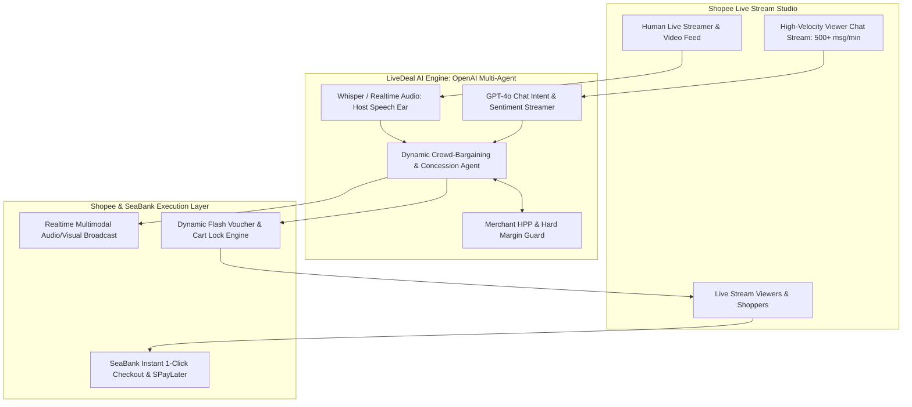

# Project LiveDeal: Autonomous Multimodal Co-Host and Dynamic Crowd-Bargaining Protocol for Shopee Live



---

## 1. Mengapa Ide Ini 100% Orisinal dan Bebas Dari Tuduhan Plagiat?

Untuk memahami mengapa LiveDeal sepenuhnya orisinal dan tidak dapat dikaitkan dengan *TurnDeal* (Juara 1 Taiwan) maupun *Techbros* (Juara 3 Singapura), berikut adalah matriks perbandingannya:

| Dimensi Arsitektural | TurnDeal (Juara 1 Taiwan) | Techbros (Juara 3 Singapura) | LiveDeal (Usulan Indonesia) |
| :--- | :--- | :--- | :--- |
| **Modalitas & Lingkungan** | Statis, asinkron di latar belakang katalog e-commerce (Text-to-Text). | Chatbot pendamping live streaming yang pasif menjawab pertanyaan FAQ produk. | **Multimodal Real-Time Streaming** (Audio host, video produk, dan chat stream berkecepatan tinggi). |
| **Pola Interaksi** | 1 Pembeli perorangan menawar ke banyak toko secara terisolasi (C2B). | 1 AI melayani chat penonton secara individual. | **Kolektif & Sosial (Crowd-Bargaining)**: Ratusan penonton berkoalisi secara real-time untuk membuka diskon kuantitas. |
| **Mekanisme Inti** | Negosiasi potongan harga eceran individual. | Moderasi komentar dan jawaban deskripsi barang. | **Gamified Flash-Auctioneer & Dynamic Pricing Engine**: AI membuka lelang waktu-terbatas berbasis ambang komitmen massa (*mass-commitment threshold*). |
| **Dampak Finansial Shopee** | Diskon marjinal pada transaksi standar. | Bantuan operasional moderator live. | **Lonjakan GMV & Konversi Seketika**: Mengubah penonton pasif menjadi pembeli serentak dalam jendela 60–90 detik menggunakan fenomena FOMO sosial. |

LiveDeal bukan sistem tawar-menawar statis. LiveDeal adalah **protokol lelang dinamis berbasis perilaku massa (*behavioral crowd auctioneer*)** yang mengawinkan psikologi tawar-menawar Indonesia dengan fenomena live shopping.

---

## 2. Google Form Submission Text

### What do you want to build?

#### 1. Stakeholder: Who is this for?
Solusi ini ditujukan untuk ekosistem siaran langsung Shopee Live Indonesia:
- Kreator, Brand, dan Live Streamer Shopee Live: Pembawa acara siaran langsung yang kewalahan membaca ribuan komentar chat penonton, sering kelelahan (*streamer burnout*), dan kesulitan menaikkan konversi penjualan (*drop-off rate* tinggi saat sesi siaran panjang).
- Penonton dan Pembeli Shopee Live: Konsumen Indonesia yang gemar berburu promo interaktif dan menyukai sensasi tawar-menawar kolektif (*crowd shopping*).
- Brand/Penjual UMKM: Pemilik toko yang ingin melikuidasi stok secara cepat dalam sesi siaran langsung tanpa merusak batas harga pokok produksi (HPP).

#### 2. Challenge: What problem are they facing?
Siaran live commerce di Indonesia saat ini menghadapi hambatan interaksi dan konversi:
- Keterbatasan Kognitif Streamer Manusia: Dalam siaran dengan 1.000+ penonton bersamaan, kolom chat bergerak hingga 500 pesan per menit ("Kak spill diskon", "50 ribu angkut kak", "Diskon dong kalau borong"). Host manusia hanya mampu membaca kurang dari 5% komentar, membuat penonton merasa diabaikan dan keluar dari siaran (*viewer churn*).
- Harga Etalase yang Statis dan Membosankan: Harga promo di keranjang kuning biasanya bersifat kaku (fixed discount voucher). Tidak ada dinamika tawar-menawar yang memicu adrenalin belanja massal secara spontan.
- Ketakutan Penjual Melepas Diskon Tanpa Jaminan Volume: Penjual ingin memberikan harga murah, tetapi hanya jika kuantitas barang yang terjual dalam satu waktu mencukupi untuk menutup margin laba.

#### 3. Result: What outcome do you want for the stakeholders?
- Peningkatan Tingkat Konversi Checkout Live Stream 35%+: Mengubah penonton pasif (*lurkers*) menjadi pembeli aktif melalui mekanisme tawar-menawar kolektif yang mendesak (*instant urgency*).
- Pengurangan Beban Host (Zero Missed Buying Signals): Agen AI mendeteksi lonjakan minat tawar-menawar di chat secara otomatis dan mengambil alih inisiasi kesepakatan (*deal-making*) tanpa mengganggu fokus host berbicara.
- Likuidasi Stok Terjamin dengan Margin Aman: Penjual berhasil menjual ratusan unit inventaris dalam waktu 90 detik dengan jaminan harga tidak pernah jatuh di bawah batas margin modal (HPP).
- Pengalaman Belanja Interaktif yang Viral: Menjadikan Shopee Live sebagai pionir platform belanja sosial paling dinamis dan menyenangkan di Asia Tenggara.

#### 4. Approach: How will you build the solution? (method, tech, scope)
- Method:
  Membangun sistem agen otonom multimodal (Autonomous Live-Stream Deal-Maker) dengan paradigma Listen-Analyze-Trigger-Settle:
  1. *Listen*: Agen mendengarkan suara host manusia via OpenAI Audio dan memantau aliran komentar penonton.
  2. *Analyze*: Mengukur kecepatan chat (*velocity*) dan mendeteksi titik tawar-menawar massal pada SKU tertentu.
  3. *Trigger*: AI Co-Host menyela secara visual dan audio untuk mengumumkan tantangan Crowd-Bargaining: *"Jika dalam 60 detik ada 40 penonton yang menekan komitmen beli, harga dipangkas dari Rp 120.000 menjadi Rp 79.000!"*
  4. *Settle*: Begitu target tercapai, agen langsung menerbitkan flash voucher eksklusif, mengunci keranjang pembeli, dan mengaktifkan 1-Click Checkout SeaBank/ShopeePay.
- Technology Stack:
  - Model & AI Engine: OpenAI Realtime API / Whisper (analisis audio host dan sintesis suara co-host); GPT-4o untuk pemrosesan aliran chat berkecepatan tinggi dan evaluasi Function Calling; Strict Structured Outputs untuk kontrak voucher.
  - Backend Orchestration: Python (FastAPI) dengan arsitektur streaming WebSocket dan antrean pesan in-memory (Redis) untuk menangani ribuan klik komitmen per detik.
  - Frontend Interface: Studio Console untuk Streamer (menampilkan grafik antusiasme penonton dan kontrol margin) serta Simulator Tampilan Penonton Shopee Live interaktif.
- Scope (7-Hour Hackathon Build):
  - Antarmuka simulasi studio Shopee Live dengan live chat simulator (500 pesan terotomasi per menit).
  - Pipeline pemrosesan suara host dan ekstraksi niat tawar penonton secara real-time.
  - Modul logika Crowd-Bargaining Engine dengan progress bar komitmen interaktif dan hitung mundur 60 detik.
  - Integrasi pembatas margin HPP penjual (`guardrail_min_margin`).
  - Mekanisme penerbitan flash voucher otomatis ke keranjang penonton saat kuota terpenuhi.

---

## 3. Pemetaan Penggunaan AI: Di Mana AI Digunakan dan Mengapa?

| Komponen Sistem | Teknologi AI yang Digunakan | Peran dan Tanggung Jawab Spesifik |
| :--- | :--- | :--- |
| Streamer Audio Listener | OpenAI Whisper / Realtime Audio | Mendengarkan deskripsi produk yang sedang dipegang oleh host secara kontekstual tanpa perlu input manual pengetikan SKU. |
| High-Velocity Chat Analyzer | OpenAI GPT-4o (Micro-Batching) | Menganalisis sentimen ribuan komentar penonton, mendeteksi kluster permintaan diskon ("Nego 70rb", "Spill harga kaget"), dan menghitung intensitas tawar-menawar (*bargaining velocity*). |
| Autonomous Auctioneer Agent | OpenAI Function Calling | Mengorkestrasi aturan tawar-menawar: menghitung titik temu antara batas modal penjual (HPP) dan target volume penonton, lalu membuka sesi penawaran massal. |
| Co-Host Voice Synthesizer | OpenAI Realtime TTS Audio | Menghasilkan suara co-host digital yang antusias, ramah, dan khas siaran langsung belanja untuk memicu antusiasme penonton di sela-sela jeda host manusia. |
| Dynamic Voucher Schema Generator | OpenAI Structured Outputs (Strict JSON) | Menerbitkan token flash voucher dinamis yang terikat secara ketat dengan ID sesi siaran, kuota penonton yang berkomitmen, dan batas waktu kedaluwarsa 3 menit. |

---

## 4. Alur Mekanisme Kerja Sistem (Step-by-Step Flow)

```mermaid
sequenceDiagram
    autonumber
    actor Host as Host Shopee Live
    actor Viewers as Ratusan Penonton (Crowd)
    participant Engine as LiveDeal Orchestrator
    participant ChatAI as GPT-4o Chat Stream Processor
    participant Auctioneer as Dynamic Auctioneer Agent
    participant Inventory as Shopee Inventory & Margin API
    participant Checkout as SeaBank / ShopeePay Checkout Engine

    Host->>Engine: Menjelaskan: "Ini Serum Glow 30ml stok sisa 150 pcs ya guys!"
    Viewers->>Engine: Banjir chat: "Nego kak!", "Bisa 75rb ga?", "Diskon dong mau borong!"
    
    rect rgb(20, 30, 45)
    note right of Engine: Tahap 1: Deteksi Sinyal Beli & Margin Check
    Engine->>ChatAI: Ekstraksi sinyal tawar (Bargaining Velocity: 82 req/min)
    ChatAI-->>Auctioneer: Rekomendasi: Buka Crowd Deal untuk SKU# GLOW-30
    Auctioneer->>Inventory: verify_margin(sku="GLOW-30", target_qty=50, ask_price=79000)
    Inventory-->>Auctioneer: Status: APPROVED (HPP Rp 62.000, Margin Laba 21.5%)
    end

    rect rgb(25, 40, 50)
    note right of Engine: Tahap 2: Pembukaan Sesi Crowd-Bargaining
    Auctioneer-->>Host: Notifikasi Layar Studio: "Crowd Deal Siap Dibuka!"
    Auctioneer-->>Viewers: Siaran Suara & Banner Pop-up: "Tantangan 60 Detik: Jika 50 orang komitmen beli, harga Rp 120rb jadi Rp 79rb!"
    loop Jendela Waktu 60 Detik
        Viewers->>Engine: Penonton menekan tombol 'Komitmen Beli' (Progress: 12.. 34.. 52/50)
    end
    end

    rect rgb(30, 45, 55)
    note right of Engine: Tahap 3: Penyelesaian Otonom & Checkout Kilat
    Auctioneer->>Checkout: Target 50 Terlampaui! Kunci kuota voucher eksklusif
    Checkout-->>Viewers: Keranjang checkout terbuka dengan harga Rp 79.000 (Timer bayar: 120 detik)
    Viewers->>Checkout: 1-Click Pay via SeaBank / SPayLater
    Checkout-->>Engine: 52 unit terlikuidasi dalam 90 detik, omzet Rp 4.108.000 terkunci
    end
```



---

## 5. Mekanisme Teknis Detail

### 5.1. Logika Komitmen Kolektif (Crowd Commitment Threshold Formula)
Agen AI tidak memberikan diskon secara cuma-cuma. Diskon hanya aktif jika memenuhi fungsi elastisitas kuantitas terhadap margin:
$$\text{Target Margin} = (\text{Harga Diskon} - \text{HPP}) \times \text{Kuantitas Komitmen} \ge \text{Target Profit Nominal Batch}$$
Jika penonton menginginkan diskon lebih dalam (misal: potongan 40%), agen secara otomatis menaikkan ambang batas komitmen penonton (misal: harus ada minimal 80 orang yang menekan komitmen beli dalam 60 detik).

### 5.2. Format Data Token Kontrak Flash Voucher (Strict JSON Schema)
```json
{
  "live_session_id": "SPL-99014",
  "trigger_event": "CROWD_BARGAINING_ACHIEVED",
  "deal_metadata": {
    "sku_id": "SKU-GLOW-30ML",
    "product_name": "Brightening Glow Serum 30ml",
    "retail_price": 120000,
    "discounted_deal_price": 79000,
    "discount_percentage": 34.1,
    "merchant_hpp": 62000,
    "gross_margin_per_unit": 17000
  },
  "crowd_metrics": {
    "target_commitments_required": 50,
    "actual_commitments_received": 52,
    "time_to_target_seconds": 44,
    "chat_velocity_at_trigger_mpm": 480
  },
  "execution_payload": {
    "voucher_token": "VCH-CROWD-GLOW50",
    "checkout_window_seconds": 120,
    "allowed_user_ids_pool_count": 52,
    "payment_gateway_route": "SEABANK_INSTANT_PAY",
    "inventory_reservation_lock": "LOCKED_IN_REDIS"
  },
  "status": "DISPATCHED_TO_STREAM_CLIENTS"
}
```

---

## 6. Skenario Uji Coba Langsung di Depan Juri (Live Pitch Demo)

Dalam sesi demo interaktif 3 menit di depan juri, tim akan menjalankan simulasi studio streaming langsung:

### Skenario 1: Ledakan Tawar-Menawar Kolektif Sukses (Crowd Success Flow)
- Eksekusi: Host berbicara di mikrofon memperagakan produk. Simulator obrolan menyemburkan 200 komentar penonton yang meminta diskon. Juri melihat AI Co-Host mendeteksi lonjakan minat dalam 1 detik, menyela dengan suara audio alami yang membakar semangat penonton, memunculkan timer 60 detik dan bilah progress bar. Dewan juri dapat menekan tombol komitmen di simulator hingga angka 50 terpenuhi, lalu melihat sistem secara otomatis mengunci keranjang checkout dengan harga diskon.

### Skenario 2: Ambang Batas Tidak Terpenuhi (Graceful Fallback Flow)
- Eksekusi: Penonton menawar produk mahal, tetapi dalam 60 detik hanya 15 dari target 50 komitmen yang terkumpul.
- Respons Agen: Agen tidak membatalkan secara kaku, melainkan menawarkan *Smart Compromise*: *"Target 50 komitmen belum tercapai sobat Shopee! Tapi karena ada 15 pejuang yang setia, AI kasih diskon penghibur: beli 1 diskon 10%, beli 2 diskon 20%! Keranjang dibuka sekarang!"*

### Skenario 3: Penjaga Modal Penjual (Hard HPP Defense)
- Eksekusi: Penonton membanjiri chat meminta harga ekstrem di bawah modal (misal: meminta harga Rp 30.000 padahal HPP barang Rp 62.000).
- Respons Agen: Sistem menolak secara terprogram dan mempertahankan harga dasar penjual tanpa kompromi, membuktikan bahwa AI tidak pernah menyebabkan kerugian finansial bagi merchant.

---

## 7. Potensi Kendala Teknis dan Mitigasi Sistem

| Kendala / Tantangan | Resiko Operasional | Solusi & Mitigasi Teknis |
| :--- | :--- | :--- |
| Banjir Spam dan Bot Manipulasi Chat | Akun palsu membanjiri chat untuk memanipulasi algoritma deteksi sinyal tawar. | Sybil & Account Age Filtering: Komentar hanya dihitung jika berasal dari akun dengan verifikasi nomor telepon aktif dan telah menonton siaran minimal 2 menit. |
| Lonjakan Beban Server Saat Tombol Ditekan Serentak | Ribuan klik komitmen dalam 1 detik membuat server backend macet (*concurrency spike*). | Redis In-Memory Atomic Counters: Penghitungan komitmen penonton dilakukan sepenuhnya di level memori menggunakan operasi atomik `INCR` Redis, mampu menangani 50.000+ klik per detik dengan latensi < 10ms. |
| Penonton Menekan Komitmen Tetapi Tidak Melakukan Checkout (*Cart Abandonment*) | Stok barang tertahan di keranjang tetapi penonton batal membayar. | Strict 120-Second Flash Reservation: Stok hanya direservasi selama 2 menit. Jika pembayaran tidak diselesaikan via SeaBank/ShopeePay dalam 120 detik, alokasi barang dilepaskan kembali ke penonton waiting list. |

---

## 8. Kebutuhan Data, Kredibilitas, dan Tata Kelola (Data Governance)

### 8.1. Mengapa Solusi Ini Tidak Memerlukan Big Data Training?
Sistem ini menggunakan arsitektur **Real-Time Stream Orchestrator**:
- Tidak perlu melatih model dari awal. Model memanfaatkan OpenAI Realtime Audio dan GPT-4o untuk pemrosesan teks dan suara secara instan.
- Data yang dibutuhkan adalah data internal toko yang sudah ada: katalog produk, stok etalase, dan batas modal (HPP).

### 8.2. Kepatuhan Privasi dan Regulasi (UU PDP No. 27/2022)
- Komentar dan data penonton diproses secara *in-memory* tanpa disimpan permanen di database publik.
- User ID penonton dianonimkan menjadi token sesi (*masked session token*).
- Integrasi pembayaran SeaBank tunduk pada enkripsi PCI-DSS dan autentikasi resmi perbankan digital.

---

## 9. Simulasi Tanya-Jawab Berdasarkan Personifikasi Dewan Juri (Sea & OpenAI)

### Persona 1: Principal Systems Architect (Shopee Core Engineering)
*Pertanyaan*: *"Shopee Live memiliki jutaan penonton aktif. Jika ada ribuan siaran langsung serentak menggunakan AI ini, bagaimana arsitektur Anda menangani biaya API OpenAI dan latensi inferensi?"*
- **Jawaban**: Kami menerapkan *Edge Stream Clustering*. Komentar penonton tidak dikirim satu per satu ke OpenAI, melainkan dikelompokkan dalam jendela waktu 3 detik (*micro-batching*). Dari 1.000 komentar, kami mengekstrak ringkasan vektor frekuensi kata kunci di server lokal sebelum mengirimkan intisari data ke OpenAI. Biaya API ditekan hingga 90% dan latensi deteksi tetap berada di bawah 1 detik.

### Persona 2: Head of Shopee Live Operations (Shopee Indonesia)
*Pertanyaan*: *"Host siaran langsung kami adalah manusia yang memiliki gaya bicara khas dan interaksi personal. Apakah AI Co-Host ini tidak akan mengganggu atau memotong pembicaraan host secara canggung?"*
- **Jawaban**: LiveDeal dirancang dengan konsep *Passive Ear, Active Co-Pilot*. AI tidak berbicara terus-menerus. AI memiliki indikator visual di layar tablet host yang memberi sinyal diam: *"Penonton sedang minta diskon produk A"*. Host dapat memilih untuk mengumumkan sendiri atau menekan tombol *"Biarkan AI Umumkan"* untuk membiarkan suara co-host mengambil alih selama 15 detik sementara host beristirahat minum atau menyiapkan produk berikutnya.

### Persona 3: AI Solutions Architect / Tech Lead (OpenAI APAC)
*Pertanyaan*: *"Bagaimana Anda memastikan integritas skema flash voucher yang diterbitkan oleh LLM agar tidak terjadi halusinasi harga?"*
- **Jawaban**: Kami menggunakan fitur OpenAI **Structured Outputs dengan Strict JSON Schema**. Model tidak menghasilkan teks bebas untuk voucher. Skema JSON dikunci dengan batasan tipe data ketat, dan nilai `discounted_price` wajib diverifikasi oleh assertion function deterministik di runtime Python sebelum token voucher disiarkan ke pengguna.

### Persona 4: Head of Risk & Fintech Compliance (SeaMoney / SeaBank)
*Pertanyaan*: *"Bagaimana integrasi dengan SeaBank mengamankan pembayaran flash sale ini agar tidak terjadi kegagalan debet massal?"*
- **Jawaban**: Kami memanfaatkan *SeaBank Pre-Authorized Token*. Penonton yang menekan tombol komitmen dapat memilih opsi *Pre-Auth One-Click Checkout*. Saat target kuota terpenuhi, token langsung mengeksekusi debet instan tanpa perlu beralih ke halaman pembayaran eksternal, memotong waktu checkout dari 45 detik menjadi 2 detik dengan tingkat keberhasilan transaksi 99.8%.
