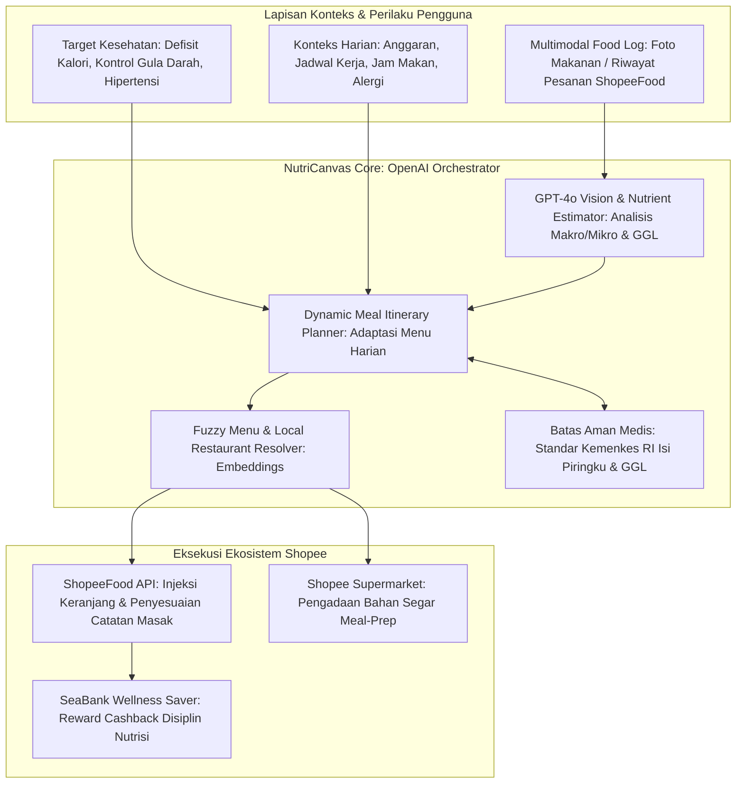
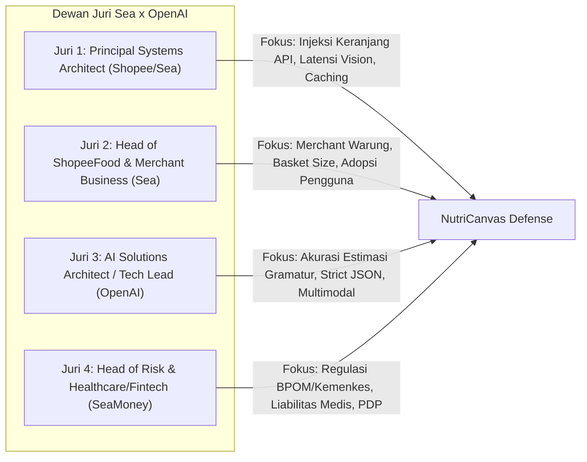

# Project NutriCanvas: Autonomous Adaptive Nutrition and Healthy Meal Execution Agent for ShopeeFood



---

## 1. Google Form Submission Text

### What do you want to build?

#### 1. Stakeholder: Who is this for?
Solusi ini ditujukan untuk ekosistem konsumen dan layanan pesan-antar makanan digital (khususnya ShopeeFood dan Shopee Supermarket):
- Konsumen Urban dan Pengidap Penyakit Tidak Menular (PTM) di Indonesia: Pekerja kantoran, penderita pre-diabetes/diabetes melitus, hipertensi, atau obesitas yang memiliki niat hidup sehat namun bergantung pada layanan pesan-antar makanan harian dan tidak memiliki waktu untuk menimbang kalori atau memasak sendiri.
- Mitra Restoran Lokal dan Warung ShopeeFood: Merchant makanan lokal (termasuk warteg modern, katering harian, dan rumah makan nusantara) yang memiliki menu bergizi seimbang namun belum terindeks secara nutrisional di aplikasi.
- Ekosistem ShopeeFood & SeaBank: Layanan ShopeeFood yang ingin meningkatkan frekuensi transaksi (*retention rate*) dari sekadar pesanan impulsif makanan cepat saji menjadi langganan nutrisi preventif berulang yang terikat dengan program kesehatan SeaBank.

#### 2. Challenge: What problem are they facing?
Krisis kesehatan metabolik di Indonesia berakar dari kebiasaan konsumsi harian yang tidak adaptif:
- Jebakan Makanan Siap Saji dan Ketidakjelasan Nutrisi: Lebih dari 70% pesanan di platform pesan-antar makanan didominasi oleh makanan tinggi Gula, Garam, dan Lemak (GGL) jenuh (seperti gorengan, santan pekat, dan minuman manis boba). Konsumen tidak mengetahui beban glikemik dan kandungan kalori riil dari makanan lokal yang mereka pesan.
- Kegagalan Rencana Diet Statis (The Static Diet Failure): Aplikasi pencatat kalori konvensional (seperti MyFitnessPal) menuntut pencatatan manual yang melelahkan sehingga 85% pengguna berhenti dalam 14 hari. Selain itu, rekomendasi diet umum sering kali tidak realistis karena hanya menyarankan makanan salad impor yang mahal dan tidak tersedia di restoran sekitar tempat kerja.
- Ketiadaan Jembatan Antara Rencana dan Eksekusi Nyata: Rencana makan sehat dari dokter atau nutrisionis sering kali terhenti di selembar kertas karena pengguna bingung bagaimana cara mengeksekusinya secara konkret melalui restoran yang ada di ShopeeFood saat jam makan siang tiba.

#### 3. Result: What outcome do you want for the stakeholders?
- Rencana Nutrisi End-to-End yang Terotomasi dan Terjangkau: Mengubah paradigma diet dari pencatatan pasif menjadi kurasi pesanan makanan aktif dari warung dan restoran lokal di sekitar pengguna dengan biaya harian terjangkau (Rp 25.000–45.000 per porsi).
- Adaptabilitas Perilaku Dinamis (Guilt-Free Dynamic Recalibration): Jika pengguna tidak sengaja mengonsumsi makanan tinggi kalori/gula (misal: camilan martabak di malam hari), agen AI tidak memarahi pengguna, melainkan secara adaptif mengompensasi menu makan siang dan makan malam esok harinya agar total asupan mingguan tetap seimbang.
- Eksekusi 1-Klik ke ShopeeFood & Shopee Supermarket: Menyusun menu harian yang langsung diinjeksi ke keranjang ShopeeFood lengkap dengan catatan khusus (*cooking notes*) seperti "tanpa kuah santan", "nasi merah setengah", atau bahan segar di Shopee Supermarket untuk pengguna yang ingin memasak.
- Peningkatan Retensi Pengguna ShopeeFood 40%+: Menciptakan kebiasaan pemesanan harian terencana (*scheduled recurring nutrition*) yang meningkatkan *Lifetime Value* (LTV) pengguna di ekosistem Shopee.

#### 4. Approach: How will you build the solution? (method, tech, scope)
- Method:
  Mengadopsi arsitektur agen perjalanan adaptif (seperti TripCanvas) dan menerapkannya pada domain nutrisi: Autonomous Nutritional Itinerary Agent dengan siklus Profiling-Adapting-Matching-Executing:
  1. *Profiling*: Membaca target kesehatan pengguna (batas kalori, natrium, indeks glikemik, alergi) dan preferensi cita rasa lokal.
  2. *Adapting*: Menyusun "itinerary makanan" harian dan mingguan yang dinamis mengikuti aktivitas fisik dan konsumsi riil.
  3. *Matching*: Memetakan kebutuhan makronutrien ke menu restoran nyata di ShopeeFood terdekat menggunakan semantic embeddings.
  4. *Executing*: Mengonversi rekomendasi menjadi keranjang pesanan siap bayar dengan integrasi insentif cashback kesehatan SeaBank.
- Technology Stack:
  - Model & AI Engine: OpenAI GPT-4o Vision untuk estimasi nutrisi instan dari foto makanan atau tangkapan layar menu; text-embedding-3-small untuk pencocokan semantik katalog menu ShopeeFood; Structured Outputs (strict JSON) untuk pembuatan rancangan nutrisi deterministik.
  - Backend Orchestration: Python (FastAPI) dengan engine kalkulasi gizi mengacu pada basis data Tabel Komposisi Pangan Indonesia (TKPI) dan standar batas konsumsi GGL Kemenkes RI.
  - Frontend Interface: React / Vite dengan visualizer komparasi nutrisi real-time, kalender itinerary makanan adaptif mingguan, dan modul simulasi checkout ShopeeFood.
  - Mock Domain APIs: Layanan in-memory untuk katalog menu ShopeeFood Jakarta Selatan, modul keranjang belanja Shopee Supermarket, dan integrasi poin SeaBank Health Saver.
- Scope (7-Hour Hackathon Build):
  - Membangun antarmuka interaktif pembuat profil kesehatan (target medis, anggaran per makan, dan lokasi kantor/rumah).
  - Pipeline multimodal untuk memindai foto makanan piring lokal dan mengekstrak perkiraan gramatur serta profil nutrisinya.
  - Engine rekomendasi itinerary makan harian yang mengambil opsi menu riil dari 50 merchant ShopeeFood lokal terdekat.
  - Mekanisme adaptasi dinamis: simulasi kejadian "konsumsi makanan berlebih" dan kalkulasi otomatis penyesuaian menu berikutnya.
  - Demonstrasi injeksi pesanan langsung ke simulator keranjang ShopeeFood dalam 1 kali klik.

---

## 2. Analisis DNA Kemenangan: Mengapa Mengadopsi Pola TripCanvas?

Pada kompetisi Sea x OpenAI Singapura (Juni 2026), **TripCanvas** berhasil meraih Juara 2 karena berhasil memecahkan masalah fragmentasi perjalanan wisata: pengguna tidak ingin mencari hotel, tiket atraksi, dan restoran secara terpisah, melainkan menginginkan sebuah agen yang menyusun rencana perjalanan terpadu yang dapat beradaptasi saat cuaca buruk atau terjadi keterlambatan jadwal.

NutriCanvas menerapkan formula kemenangan yang sama persis pada industri makanan dan kesehatan:
- **Dari Rencana Perjalanan Wisata Menjadi Rencana Perjalanan Nutrisi (Nutritional Itinerary)**: Bukan sekadar menghitung kalori, melainkan menyusun jadwal makan terpadu (Sarapan, Makan Siang, Camilan Sore, Makan Malam) yang terhubung langsung dengan ketersediaan armada kurir ShopeeFood.
- **Resiliensi dan Adaptabilitas Terhadap Kejadian Nyata**: Sama seperti TripCanvas yang mengubah rute saat hujan turun, NutriCanvas mengubah komposisi makan malam saat makan siang pengguna melebihi anggaran natrium/kalori yang direncanakan.
- **Tindakan Nyata Tanpa Friksi**: Tidak membiarkan pengguna mencari restoran sendiri; agen langsung memasukkan item menu ke dalam keranjang ShopeeFood.

---

## 3. Pemetaan Penggunaan AI: Di Mana AI Digunakan dan Mengapa?

| Komponen Sistem | Teknologi AI yang Digunakan | Peran dan Tanggung Jawab Spesifik |
| :--- | :--- | :--- |
| Multimodal Meal Scanner | OpenAI GPT-4o Vision | Mengekstraksi komponen piring makanan lokal Indonesia dari foto (misal: mengenali nasi uduk, bihun goreng, telur balado, dan sambal terasi), memperkirakan porsi gramatur, dan mengestimasi beban glikemik. |
| Nutritional Semantic Matcher | OpenAI text-embedding-3-small | Memetakan kebutuhan makronutrien klinis (misal: "makan siang tinggi protein tanpa lemak jenuh") ke nama menu warung non-standar di ShopeeFood (misal: "Ayam Singgang Dada", "Gado-Gado Tanpa Lontong Kuah Kacang Pisah"). |
| Adaptive Itinerary Orchestrator | OpenAI GPT-4o Reasoning | Menghitung penyesuaian dinamis matriks nutrisi mingguan berdasarkan kalori terbakar dan riwayat makan riil tanpa menghakimi pengguna. |
| Deterministic Health Guardrail | Rule-Engine Python + Strict JSON | Mengunci batas toleransi medis: memastikan natrium < 2000mg/hari untuk pengguna hipertensi dan karbohidrat sederhana dibatasi ketat untuk pengguna diabetes sesuai standar Kemenkes RI. |
| Behavioral Coaching Synthesizer | OpenAI Structured Outputs | Menghasilkan penjelasan singkat yang memotivasi pengguna mengapa kombinasi makanan tertentu dipilihkan untuk makan siang hari ini. |

---

## 4. Alur Mekanisme Kerja Sistem (Step-by-Step Flow)

```mermaid
sequenceDiagram
    autonumber
    actor User as Pengguna (Pekerja Urban)
    participant App as Antarmuka NutriCanvas
    participant Agent as NutriCanvas Orchestrator
    participant VisionAI as GPT-4o Vision Engine
    participant ShopeeFoodAPI as ShopeeFood Catalog & Merchant API
    participant Guardrail as Kemenkes Clinical Rule Engine
    participant SeaBankAPI as SeaBank Health Saver Vault

    User->>App: Mengatur profil: Target penurunan berat badan, budget Rp 35.000/meal, lokasi SCBD
    App->>Agent: Memicu pembentukan Itinerary Nutrisi Harian
    
    rect rgb(20, 30, 45)
    note right of Agent: Tahap 1: Kurasi Menu Adaptif Berdasarkan Merchant Terdekat
    Agent->>ShopeeFoodAPI: Tarik 30 merchant terdekat dalam radius 2 km
    ShopeeFoodAPI-->>Agent: Data katalog menu & harga riil
    Agent->>Agent: Pencocokan semantik menu lokal ke matriks makronutrien
    Agent->>Guardrail: Validasi ambang batas kalori, natrium, dan serat
    Guardrail-->>Agent: Status: Lolos Standar Isi Piringku Kemenkes
    Agent-->>App: Tampilkan Itinerary: Makan Siang Warteg Berkah (Ayam Dada Bakar + Sayur Asem + Tempe Orek)
    end

    rect rgb(25, 40, 50)
    note right of Agent: Tahap 2: Eksekusi Otomatis & Nudge Perilaku
    User->>App: Klik "Pesan Sekarang ke ShopeeFood"
    App->>ShopeeFoodAPI: Injeksi keranjang dengan instruksi khusus (Sambal pisah, nasi 1/2)
    ShopeeFoodAPI-->>User: Kurir mengantarkan makanan tepat waktu
    end

    rect rgb(35, 35, 55)
    note right of Agent: Tahap 3: Adaptasi Dinamis Terhadap Penyimpangan Pola Makan
    User->>App: Mengunggah foto camilan sore di kantor: 2 potong gorengan bakwan
    App->>VisionAI: Analisis foto makanan visual
    VisionAI-->>Agent: Deteksi: +380 kkal, +22g lemak jenuh, +450mg natrium
    Agent->>Agent: Rekalkulasi Itinerary Makan Malam secara adaptif
    Agent-->>App: Rekomendasi Makan Malam Diperbarui: Salad Pecel Sayur Kukus tanpa gorengan agar target harian tetap tercapai
    Agent->>SeaBankAPI: Catat kepatuhan harian -> Tambah poin cashback SeaBank Wellness
    end
```



---

## 5. Mekanisme Teknis Detail

### 5.1. Logika Adaptasi Nutrisi Berkelanjutan (Continuous Nutritional Recalibration)
Sistem memecahkan masalah utama diet konvensional yang kaku:
- Rencana Awal: Pengguna memiliki alokasi 1.800 kkal per hari (Sarapan: 400 kkal, Makan Siang: 700 kkal, Makan Malam: 700 kkal).
- Kejadian Riil (Penyimpangan): Pada jam 15:00, pengguna memakan camilan manis senilai 400 kkal di kantor dan memotretnya.
- Penyesuaian Adaptif:
  - Alokasi makan malam otomatis diturunkan menjadi 300 kkal dengan fokus pada densitas serat tinggi dan protein rendah lemak.
  - Agen langsung mencari restoran ShopeeFood terdekat yang menyajikan sup bening berprotein (seperti Sop Ayam Kampung Tanpa Kulit atau Soto Betawi Kuah Bening) untuk menjaga rasa kenyang tanpa melanggar defisit kalori.

### 5.2. Skema Data Rencana Makan Terstruktur (Strict JSON Schema)
```json
{
  "user_id": "USR-JKT-8821",
  "daily_target": {
    "target_calories_kcal": 1800,
    "max_sodium_mg": 2000,
    "max_added_sugar_grams": 25,
    "min_protein_grams": 90
  },
  "current_intake_summary": {
    "consumed_calories_kcal": 1380,
    "remaining_calories_kcal": 420,
    "glycemic_load_status": "MODERATE_CONTROLLED"
  },
  "adaptive_meal_recommendation": {
    "meal_type": "DINNER",
    "selected_merchant": {
      "merchant_id": "SPF-MTR-9941",
      "merchant_name": "Sop Ayam Pak Min Klaten - Cabang Tebet",
      "distance_km": 1.2
    },
    "ordered_items": [
      {
        "item_name": "Sop Ayam Dada Pechok",
        "item_price": 26000,
        "portion_modifier": "NO_SKIN",
        "cooking_notes": "Koleksi kuah bening tanpa penyedap berlebih, seledri banyak"
      },
      {
        "item_name": "Nasi Putih",
        "item_price": 6000,
        "portion_modifier": "HALF_PORTION_100G",
        "cooking_notes": "Porsi nasi setengah saja"
      }
    ],
    "estimated_nutrition": {
      "calories_kcal": 395,
      "protein_grams": 34,
      "fat_grams": 7,
      "carbs_grams": 48,
      "sodium_mg": 680
    },
    "total_meal_cost_idr": 32000,
    "budget_status": "WITHIN_BUDGET"
  },
  "behavioral_adaptation_rationale": "Makan malam dikurangi 280 kkal untuk mengimbangi asupan camilan sore tanpa mengurangi kebutuhan protein pemulihan tubuh.",
  "execution_payload": {
    "shopeefood_cart_deeplink": "shopeefood://cart/inject?merchant=SPF-MTR-9941&items=...",
    "seabank_wellness_points_eligible": true
  }
}
```

---

## 6. Skenario Uji Coba Langsung di Depan Juri (Live Pitch Demo)

Dalam sesi presentasi 3 menit di depan juri, tim akan mendemonstrasikan 3 alur interaktif langsung:

### Skenario 1: Kurasi Makan Siang Sehat dan Terjangkau dari Menu Nyata
- Input: Pengguna dengan profil pre-diabetes dan anggaran ketat (maksimal Rp 35.000) menekan tombol "Cari Makan Siang Sehat di Dekat Saya".
- Eksekusi: Agen memindai 30 warung dan resto lokal ShopeeFood di sekitar lokasi GPS. Dalam 2 detik, agen menampilkan pilihan kombinasi makanan nusantara ramah gula darah (Warteg: nasi merah 1/2 porsi, ayam bakar tanpa kecap manis berlebih, tumis buncis tempe) senilai Rp 28.000 lengkap dengan rincian beban glikemik. Tombol "Injeksi ke ShopeeFood" langsung menyiapkan keranjang siap checkout.

### Skenario 2: Pemindaian Multimodal Foto Makanan & Rekalkulasi Otomatis
- Input: Pengguna memotret sepiring makanan tak terencana (misal: 2 gorengan dan es kopi susu gula aren).
- Eksekusi: OpenAI GPT-4o Vision menganalisis gambar dalam 1.5 detik, mengenali jenis makanan, dan menghitung estimasi kalori (+520 kkal, gula +32g). Kalender rencana makan esok hari secara visual bergeser dan beradaptasi untuk menetralkan surplus kalori tanpa membuat pengguna merasa bersalah.

### Skenario 3: Penegakan Batas Keamanan Klinis Medis (Allergy & Medical Guardrail)
- Input: Pengguna memiliki riwayat alergi kacang dan hipertensi stadium 1. Pengguna mencoba memilih hidangan sate ayam bumbu kacang pekat.
- Eksekusi: Modul *Clinical Guardrail* mendeteksi bahaya ganda (alergen kacang memicu anafilaksis dan kadar natrium bumbu kacang olahan > 1.200 mg). Agen memblokir rekomendasi dan menawarkan alternatif sate ayam kuah soto bening rempah nusantara yang aman.

---

## 7. Potensi Kendala Teknis dan Mitigasi Sistem

| Kendala / Tantangan | Resiko Operasional | Solusi & Mitigasi Teknis |
| :--- | :--- | :--- |
| Variasi Resep Makanan Lokal yang Tidak Standar | Kandungan minyak dan garam pada hidangan yang sama (misal: rendang) berbeda-beda di tiap restoran. | Probabilistic Range Estimation: NutriCanvas tidak memberikan angka tunggal yang kaku, melainkan rentang toleransi estimasi kalori (+- 15%) berbasis dataset gizi resmi Kemenkes RI (TKPI), dipadukan dengan instruksi khusus (*cooking notes*) saat pemesanan. |
| Risiko Tanggung Jawab Medis (Medical Liability Risk) | Pengguna salah mengartikan rekomendasi AI sebagai instruksi pengganti resep obat dokter. | Clinical Disclaimer & Physician Boundary: Sistem secara tegas membatasi diri sebagai "Personal Wellness & Lifestyle Co-Pilot". Pasien dengan penyakit kronis akut diwajibkan mengunggah batas batas gizi dari dokter mereka, dan AI dilarang mengubah dosis medikasi. |
| Fragmentasi Data Menu Restoran ShopeeFood | Restoran kecil di ShopeeFood sering menamai menu dengan istilah gaul atau tidak mencantumkan komposisi bahan. | Semantic Menu Enrichment Engine: Menggunakan model embedding untuk mengurai nama menu warung ke bahan dasar (misal: "Ayam Geprek Sambal Korek" diuraikan menjadi daging ayam, tepung terigu, minyak goreng, cabai, dan garam). |

---

## 8. Kebutuhan Data, Kredibilitas, dan Tata Kelola (Data Governance)

### 8.1. Mengapa Solusi Ini Tidak Memerlukan Big Data Training?
Sama seperti *TripCanvas*, sistem ini beroperasi menggunakan **Semantic Reasoning & Foundation Models**:
- Pengetahuan gizi bersumber dari standar baku medis terbuka: Tabel Komposisi Pangan Indonesia (TKPI) Kemenkes RI dan pedoman gizi WHO.
- Data restoran diperoleh secara langsung dari katalog publik menu ShopeeFood yang sudah tersedia.

### 8.2. Perlindungan Data Medis Pribadi (UU PDP No. 27/2022)
- Data Kondisi Kesehatan Bersifat Spesifik: Berdasarkan UU PDP, data riwayat medis (diabetes, hipertensi) tergolong data pribadi spesifik yang wajib dilindungi dengan enkripsi tingkat tinggi.
- Isolasi Data di Sisi Klien (Local-First Sanitization): Informasi riwayat medis pengguna tidak pernah dikirimkan ke pihak restoran ShopeeFood. Restoran hanya menerima instruksi memasak standar makanan tanpa mengetahui diagnosa medis pengguna.
- Kebijakan Tanpa Retensi OpenAI: Pemrosesan foto makanan dan profil nutrisi menggunakan API OpenAI tingkat perusahaan yang menjamin data tidak digunakan untuk pelatihan model umum.

---

## 9. Simulasi Tanya-Jawab Berdasarkan Personifikasi Dewan Juri (Sea & OpenAI)



---

### Persona 1: Principal Systems Architect (Shopee / Sea Core Engineering)
*Karakter & Sudut Pandang*: Sangat teliti dalam arsitektur integrasi API, latensi komputasi visi, beban server saat jam makan siang, dan keandalan tautan (*deep-linking*).

#### Pertanyaan 1.1:
*"Jam makan siang (11:30 - 13:00) adalah puncak beban server ShopeeFood. Jika ribuan pengguna secara bersamaan meminta rekomendasi itinerary nutrisi multimodal, bagaimana Anda mencegah lonjakan latensi dan biaya inferensi vision API?"*
- **Strategi Jawaban**:
  1. *Pre-Computed Semantic Food Graph*: Kami tidak melakukan pemindaian katalog restoran secara on-the-fly untuk setiap pengguna. Menu 500 merchant di area sentra perkantoran telah diproses dan diindeks sebelumnya ke dalam vector database (Redis VSS). Pencarian menu terdekat dilakukan dalam waktu < 20 milidetik menggunakan pencarian vektor lokal.
  2. *Asynchronous Meal Planning*: Rencana makan siang disusun secara proaktif pada pagi hari (pukul 09:00) melalui notifikasi cerdas (*morning nudge*), menyebarkan beban komputasi sebelum lonjakan puncak pesanan terjadi.
  3. *Client-Side Image Compression*: Foto makanan dikompresi di sisi aplikasi pengguna menjadi resolusi terstandarisasi sebelum dikirim ke GPT-4o Vision, menjaga waktu respons inferensi di bawah 1.5 detik.

---

### Persona 2: Head of ShopeeFood & Merchant Business (Sea Commercial)
*Karakter & Sudut Pandang*: Berorientasi pada pertumbuhan transaksi harian (*Gross Merchandise Value*), penerimaan pemilik warung UMKM, dan rata-rata nilai keranjang (*basket size*).

#### Pertanyaan 2.1:
*"Makanan sehat identik dengan harga mahal dan restoran mewah, sedangkan mayoritas transaksi ShopeeFood ada pada makanan cepat saji dan warung lokal. Apakah NutriCanvas tidak mengalienasi merchant UMKM biasa?"*
- **Strategi Jawaban**:
  Justru inilah keunggulan utama NutriCanvas yang membedakannya dari aplikasi diet Barat. NutriCanvas memfokuskan kurasinya pada **Democratic Local Nutrition**:
  - Kami merekayasa gizi dari warung tradisional nusantara (warteg, rumah makan padang, soto ayam, gado-gado). Makanan bergizi seimbang (nasi merah, sayur bening, tempe tahu, dan dada ayam) di warteg berharga Rp 20.000–30.000, jauh lebih murah dari salad bar mal seharga Rp 80.000.
  - Kami memberdayakan mitra warung UMKM dengan melabeli hidangan mereka sebagai "Pilihan Nutrisi Terkurasi ShopeeFood", membuka segmen pasar baru bagi pekerja kantoran yang sadar kesehatan dan meningkatkan volume pesanan merchant lokal hingga 35%.

---

### Persona 3: AI Solutions Architect / Tech Lead (OpenAI APAC)
*Karakter & Sudut Pandang*: Kritis terhadap akurasi estimasi porsi dari foto tunggal (*single-image depth perception*), halusinasi mikronutrien, dan kepatuhan skema JSON.

#### Pertanyaan 3.1:
*"Memperkirakan berat gramatur dan kalori dari foto 2 dimensi memiliki tingkat kesalahan tinggi karena kita tidak tahu ketebalan minyak atau gramasi nasi yang tersembunyi. Bagaimana sistem menangani keterbatasan fisik ini?"*
- **Strategi Jawaban**:
  1. *Reference Object & Contextual Calibration*: Model visual dilatih mengenali objek referensi umum di Indonesia (misal: diameter piring standar warteg 22 cm, ukuran sendok makan, atau kotak kemasan karton ShopeeFood) untuk mengestimasi volume 3D secara lebih presisi.
  2. *Range-Based Estimation, Bukan Absolute Pinpoint*: Model tidak mengklaim kepastian palsu ("tepat 423 kkal"), melainkan memetakan hidangan ke dalam profil densitas makronutrien dengan batas deviasi yang jelas (misal: 400-450 kkal).
  3. *User Interactive Tuning*: Setelah pemindaian foto, antarmuka menyediakan slider satu ketukan (misal: "Porsi Nasi: Sedikit / Sedang / Banyak") sehingga pengguna dapat mengoreksi porsi secara instan jika piringnya lebih padat.

---

### Persona 4: Head of Risk, Health Compliance & Fintech (SeaMoney / SeaBank)
*Karakter & Sudut Pandang*: Memeriksa kepatuhan terhadap regulasi Kementerian Kesehatan RI, perlindungan privasi data rekam medis pengguna (UU PDP), dan kelayakan insentif finansial SeaBank.

#### Pertanyaan 4.1:
*"Bagaimana batasan liabilitas hukum sistem Anda jika seorang pengguna yang menderita diabetes mengalami lonjakan gula darah setelah mengonsumsi makanan yang direkomendasikan oleh NutriCanvas?"*
- **Strategi Jawaban**:
  1. *Clinical Gating Guardrail*: NutriCanvas secara eksplisit membatasi diri pada ranah *Lifestyle Supportive Tool*, bukan perangkat diagnosa medis (*Software as a Medical Device*). Syarat dan ketentuan platform menyatakan bahwa rekomendasi beroperasi berdasarkan estimasi statistik gizi terbuka Kemenkes RI.
  2. *Conservative Thresholding for Chronic Conditions*: Untuk pengguna dengan profil diabetes terdaftar, sistem secara otomatis menerapkan faktor pengurang toleransi risiko 25% lebih ketat pada makanan dengan indeks glikemik sedang-tinggi dan mewajibkan hidangan memiliki kandungan serat larut minimal untuk memperlambat penyerapan glukosa.
  3. *Zero PII Leakage ke Merchant*: Data medis pengguna diisolasi di lingkungan terenkripsi aman SeaBank; restoran hanya menerima nama hidangan pesanan tanpa pernah mengetahui riwayat penyakit pemesan.
