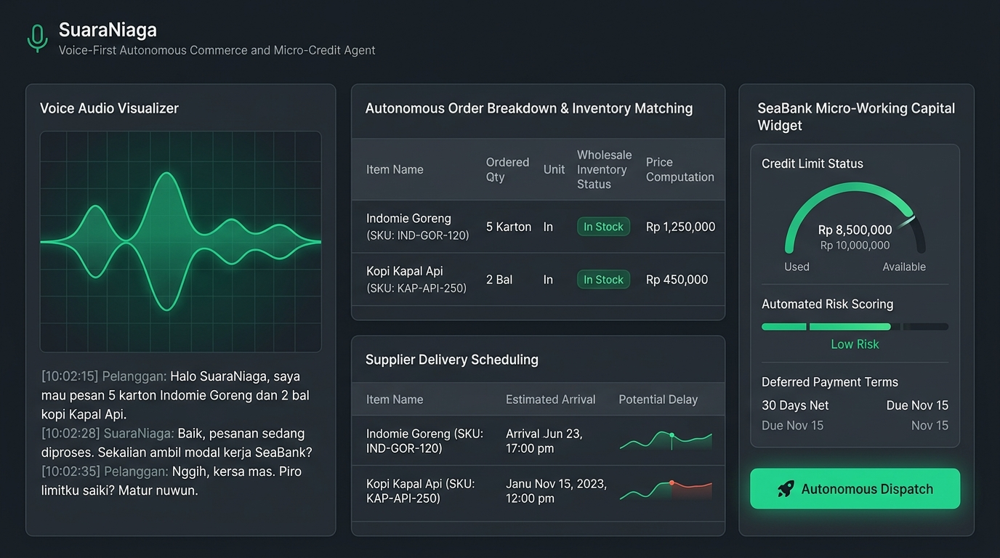

# Project SuaraNiaga: Multilingual Voice-First Autonomous Commerce and Micro-Credit Agent



---

## 1. Google Form Submission Text

### What do you want to build?

#### 1. Stakeholder: Who is this for?
Solusi ini ditujukan untuk dua pemangku kepentingan utama dalam ekosistem perdagangan mikro dan inklusi keuangan digital Indonesia (khususnya ekosistem Mitra Shopee dan SeaBank):
- Pemilik Warung Kelontong dan Pedagang Tradisional Tier 2/3: Pelaku usaha mikro non-digital native atau semi-literate yang kesulitan menavigasi aplikasi e-commerce rumit dengan ratusan menu dan formulir digital, namun mengandalkan percakapan lisan sehari-hari untuk operasional toko.
- Tim Operasional Rantai Pasok Grosir dan Risk Underwriting: Penyedia pasokan grosir FMCG (Mitra Shopee) dan divisi kredit mikro digital (SeaBank / SPayLater for Business) yang membutuhkan efisiensi distribusi barang dan penyaluran modal kerja produktif tanpa risiko tinggi.

#### 2. Challenge: What problem are they facing?
Digitalisasi ritel mikro di Indonesia menghadapi kesenjangan literasi antarmuka dan hambatan likuiditas kas:
- Kompleksitas Antarmuka Digital: Mayoritas pemilik warung di kota tier 2, tier 3, dan area rural enggan menggunakan aplikasi e-commerce B2B karena rumitnya pencarian SKU (seperti varian gramatur dan kemasan karton), keranjang belanja berbelit-belit, dan hambatan mengetik istilah baku. Mereka tetap bergantung pada sales kanvaser manual atau pesan suara WhatsApp yang rawan salah catat.
- Hambatan Likuiditas Modal Kerja Harian: Warung sering mengalami kehabisan stok barang cepat laku (stockout) karena perputaran kas harian terbatas. Pengajuan pinjaman modal kerja konvensional membutuhkan dokumen administratif rumit yang tidak dimiliki pedagang mikro.
- Inefisiensi Pemrosesan Pesanan Non-Standar: Pesan suara atau catatan lisan yang dikirimkan pedagang ke distributor grosir memerlukan input manual berulang kali oleh tim admin, menimbulkan kesalahan pengiriman barang dan penundaan jadwal distribusi logistik.

#### 3. Result: What outcome do you want for the stakeholders?
- Restok Grosir Otonom Berbasis Suara di Bawah 45 Detik: Pedagang dapat memesan pasokan barang dagangan hanya dengan berbicara secara natural dalam bahasa Indonesia atau dialek daerah (seperti bahasa Jawa ngoko/krama dan Sunda) tanpa menyentuh menu aplikasi.
- Akses Modal Kerja Mikro Instan (Zero-Friction Underwriting): Integrasi langsung dengan modal kerja SeaBank secara otonom saat pemesanan, memungkinkan pembayaran tempo 14-30 hari yang disetujui dalam hitungan detik berbasis riwayat transaksi warung.
- Eliminasi Kesalahan Pemenuhan Barang (Zero SKU Mismatch): Mengonversi percakapan lisan tidak terstruktur menjadi daftar SKU terverifikasi secara deterministik terhadap katalog stok pergudangan Mitra Shopee.
- Peningkatan Volume Transaksi Ritel Mikro 30%+: Membantu warung mempertahankan ketersediaan stok barang pokok tanpa kendala kekurangan kas tunai harian.

#### 4. Approach: How will you build the solution? (method, tech, scope)
- Method:
  Membangun agen perdagangan otonom berbasis antarmuka suara (Voice-First Autonomous Agent) dengan paradigma Voice-to-Intent-to-Execution. Agen menangkap input suara dialek lokal, melakukan normalisasi entitas produk dan kuantitas, memvalidasi stok pergudangan secara real-time via tool calling, mengalkulasi batas kredit mikro SeaBank secara deterministik, lalu memberikan konfirmasi balik dalam format suara natural sebelum menerbitkan instruksi pengiriman.
- Technology Stack:
  - Model & AI Engine: OpenAI Realtime Audio API / Whisper untuk pemrosesan percakapan dwibahasa dan dialek lokal; GPT-4o untuk penalaran ekstraksi entitas pesanan dan Function Calling terstruktur.
  - Backend Orchestration: Python (FastAPI) dengan arsitektur event-driven untuk mengelola sesi percakapan audio WebSocket, pencarian katalog fuzzy, dan integrasi API perbankan.
  - Frontend Interface: React / Vite dengan antarmuka tablet/mobile berbasis visualizer gelombang suara, rekap pesanan langsung (live order sheet), dan panel kontrol persetujuan modal kerja SeaBank.
  - Mock Domain APIs: Layanan in-memory untuk katalog stok grosir Mitra Shopee, mesin skor kredit mikro SeaBank, dan modul penjadwalan armada logistik lokal.
- Scope (7-Hour Hackathon Build):
  - Mengembangkan antarmuka interaktif yang menerima input suara langsung via mikrofon dan menampilkan transkrip dwibahasa secara instan.
  - Mengimplementasikan pipeline Function Calling untuk 3 tool: `match_wholesale_inventory`, `check_seabank_credit_limit`, dan `dispatch_procurement_order`.
  - Membangun katalog 50 SKU barang pokok FMCG terpopuler (sembako, mie instan, kopi kemasan, minyak goreng) dengan sinonim sebutan pasar tradisional.
  - Menyiapkan mekanisme konfirmasi suara interaktif sebelum transaksi dieksekusi secara otonom.
  - Menampilkan audit trail finansial dan riwayat keputusan kredit mikro pada konsol operasional.

---

## 2. Pemetaan Penggunaan AI: Di Mana AI Digunakan dan Mengapa?

Dalam sistem SuaraNiaga, kecerdasan buatan berperan sebagai jembatan alami antara percakapan manusia sehari-hari dan sistem basis data transaksional perusahaan:

| Komponen Sistem | Teknologi AI yang Digunakan | Peran dan Tanggung Jawab Spesifik |
| :--- | :--- | :--- |
| Dialect Speech Recognition | OpenAI Realtime Audio / Whisper | Mengonversi suara ucapan bahasa Indonesia sehari-hari, bahasa Jawa, dan bahasa Sunda yang bercampur slang pasar menjadi transkrip teks fonetik yang akurat. |
| Colloquial Intent & Entity Extractor | OpenAI GPT-4o Reasoning | Mengekstrak niat belanja multi-item, merek lokal, kuantitas informal (misal: "2 dus", "3 bal", "5 renceng", "sak karung"), dan opsi termin pembayaran tempo dari kalimat acak. |
| Fuzzy Product Resolver | Embeddings (text-embedding-3-small) + Rule Normalizer | Memetakan penyebutan bahasa pasar tradisional (misal: "minyak bantal kemasan sedeng", "kopi kapal api ireng") ke kode SKU resmi dalam katalog pergudangan. |
| Autonomous Banking Orchestrator | OpenAI Function Calling | Memanggil API perbankan digital SeaBank secara independen untuk memeriksa batas limit kredit warung, menghitung bunga tempo, dan memvalidasi kelayakan risiko pinjaman mikro. |
| Conversational Voice Synthesizer | OpenAI Realtime Voice / Audio Output | Menghasilkan respons suara balasan yang ramah dan alami dalam bahasa yang dipahami pengguna untuk meminta konfirmasi akhir sebelum dana didebet atau pesanan dikirim. |

---

## 3. Alur Mekanisme Kerja Sistem (Step-by-Step Flow)

```mermaid
sequenceDiagram
    autonumber
    actor Merchant as Pemilik Warung
    participant VoiceUI as Voice Stream Client
    participant Agent as SuaraNiaga Orchestrator
    participant AudioAI as OpenAI Audio & LLM Core
    participant CatalogAPI as Mitra Shopee Inventory API
    participant BankAPI as SeaBank Micro-Credit API
    participant LogisticsAPI as Delivery Dispatch Engine

    Merchant->>VoiceUI: Berbicara: "Pesen Indomie goreng 5 karton, kopi 2 bal, bayar tempo SeaBank ya."
    VoiceUI->>Agent: Stream audio chunk via WebSocket
    
    rect rgb(20, 35, 30)
    note right of Agent: Tahap 1: Pemrosesan Suara & Ekstraksi Entitas
    Agent->>AudioAI: Ingest audio stream
    AudioAI-->>Agent: Output terstruktur: Items [Indomie Goreng x 5 karton, Kopi Kapal Api x 2 bal], Payment: SeaBank Tempo
    end

    rect rgb(25, 40, 35)
    note right of Agent: Tahap 2: Grounding Stok & Penjaminan Modal Kerja
    Agent->>CatalogAPI: match_wholesale_inventory(items)
    CatalogAPI-->>Agent: SKU Valid, Stok Tersedia, Total Nilai: Rp 1.700.000
    Agent->>BankAPI: evaluate_micro_credit(merchant_id, amount=1700000, term=30)
    BankAPI-->>Agent: Limit Tersedia: Rp 8.500.000, Risk Score: Low, Status: Pre-Approved
    end

    rect rgb(30, 45, 40)
    note right of Agent: Tahap 3: Konfirmasi Suara & Eksekusi Otonom
    Agent->>AudioAI: Generate verbal confirmation payload
    AudioAI-->>VoiceUI: Suara respon: "Total Rp 1.700.000 dengan tempo SeaBank 30 hari. Dikirim besok jam 10 pagi, nggih?"
    VoiceUI-->>Merchant: Putar suara konfirmasi ke speaker
    Merchant->>VoiceUI: Menjawab: "Nggih, kersa mas. Proses langsung."
    VoiceUI->>Agent: Voice confirmation detected
    Agent->>BankAPI: commit_credit_drawdown(amount=1700000)
    Agent->>LogisticsAPI: schedule_delivery(order_id, delivery_slot="Tomorrow 10:00")
    Agent-->>VoiceUI: Perbarui status dashboard: Otonom Berhasil Dieksekusi
    end
```



---

## 4. Mekanisme Teknis Detail

### 4.1. Pemrosesan Bahasa Alami dan Penanganan Dialek Lokal
Pedagang di pasar tradisional sering mencampurkan bahasa Indonesia dengan kosakata daerah:
- Contoh Masukan: *"Mbak, aku butuh minyak goreng Tropical sing rong literan limo karton, rokok Sampoerna Mild rong pres, karo beras Ramos limang karung. Talangi disik nganggo modal SeaBank yo, bayare sasi ngarep."*
- Ekstraksi Agen:
  - SKU 1: Minyak Goreng Tropical 2 Liter | Kuantitas: 5 Karton | Satuan Standar: KARTON_6X2L
  - SKU 2: Rokok Sampoerna Mild 16 | Kuantitas: 2 Pres (Slop) | Satuan Standar: SLOP_10PACK
  - SKU 3: Beras Ramos 50kg | Kuantitas: 5 Karung | Satuan Standar: SAK_50KG
  - Metode Bayar: Modal Kerja Produktif SeaBank | Tenor: 30 Hari (Bulan Depan)

### 4.2. Penjaminan Modal Kerja Digital SeaBank (Micro-Credit Underwriting)
Setiap pesanan tempo diproses melalui evaluasi risiko kredit deterministik:
- Tool `evaluate_micro_credit`: Memeriksa saldo plafon kredit yang masih aktif pada akun pedagang.
- Risk Scoring Heuristic: Berdasarkan frekuensi perputaran transaksi toko dalam 60 hari terakhir di ekosistem Mitra Shopee. Jika toko memiliki rekam jejak penyelesaian transaksi baik, penarikan kredit disetujui secara otonom dalam 500 milidetik.
- Dynamic Repayment Schedule: Agen menghitung jadwal jatuh tempo, estimasi biaya bunga transparan, dan tanggal debet otomatis rekening SeaBank pedagang.

### 4.3. Format Output Terstruktur (Strict JSON Schema)
Agen menggunakan Structured Outputs untuk memastikan komunikasi bebas kesalahan dengan backend logistik dan finansial:

```json
{
  "order_session_id": "SN-7729",
  "merchant_profile": {
    "merchant_id": "MTR-88129",
    "store_name": "Toko Berkah Barokah",
    "location": "Bantul, D.I. Yogyakarta",
    "preferred_language": "ID_JV_MIXED"
  },
  "parsed_items": [
    {
      "spoken_phrase": "Indomie goreng lima karton",
      "matched_sku": "IND-GOR-120",
      "product_name": "Indomie Mi Instan Goreng 85g (Karton 40 pcs)",
      "quantity": 5,
      "unit_price": 250000,
      "subtotal": 1250000,
      "inventory_status": "IN_STOCK"
    },
    {
      "spoken_phrase": "Kopi kapal api dua bal",
      "matched_sku": "KAP-API-250",
      "product_name": "Kopi Kapal Api Spesial Mix (Bal 20 Renceng)",
      "quantity": 2,
      "unit_price": 225000,
      "subtotal": 450000,
      "inventory_status": "IN_STOCK"
    }
  ],
  "financial_evaluation": {
    "total_order_amount": 1700000,
    "payment_method": "SEABANK_WORKING_CAPITAL_TEMPO",
    "requested_tenor_days": 30,
    "available_credit_limit": 8500000,
    "pre_approval_status": "APPROVED",
    "calculated_due_date": "2026-11-09"
  },
  "execution_state": "AWAITING_VERBAL_CONFIRMATION",
  "audit_trail": [
    "Input audio dialek Jawa-Indonesia berhasil dinormalisasi",
    "Seluruh SKU cocok dengan katalog gudang regional Bantul",
    "Limit kredit SeaBank mencukupi dan tingkat risiko rendah",
    "Menunggu konfirmasi audio final pedagang"
  ]
}
```

### 4.4. Pembatasan Pengaman Otonom (Guardrails & Fraud Gating)
- Ambang Batas Nilai Pesanan: Penarikan kredit modal kerja otonom instan dibatasi maksimal Rp 3.000.000 per transaksi suara. Pesanan di atas ambang batas memerlukan otorisasi PIN biometrik atau verifikasi kode SMS OTP di perangkat pedagang.
- Voice Challenge Anti-Spurious: Untuk menghindari pemesanan tidak sengaja dari kebisingan latar belakang warung, agen mewajibkan konfirmasi kata kunci spesifik (misal: "Setuju", "Proses", atau "Nggih leres") sebelum data pesanan dikunci.

---

## 5. Matriks Fitur Prototipe Hackathon

| Modul | Fitur | Status Target 7 Jam |
| :--- | :--- | :--- |
| Voice Ingestion Portal | Perekaman audio mikrofon interaktif dengan visualisasi gelombang frekuensi | Fungsional penuh |
| Dialect Parser Engine | Transkripsi dan ekstraksi entitas dwibahasa (Indonesia & Jawa) | Fungsional penuh |
| Wholesale Catalog Matcher | Pencarian kecocokan SKU FMCG sembako secara fuzzy | Fungsional penuh |
| SeaBank Underwriting Engine | Evaluasi limit kredit mikro dan simulasi perhitungan tenor tempo | Fungsional penuh |
| Two-Way Audio Synthesizer | Pemutaran respon konfirmasi suara verbal ke speaker | Fungsional penuh |
| Logistics Scheduler | Mock penjadwalan armada logistik lokal Mitra Shopee | Fungsional penuh |

---

## 6. Skenario Uji Coba Langsung di Depan Juri (Live Pitch Demo)

Dalam sesi demo interaktif 3 menit di depan juri, tim akan mendemonstrasikan 3 skenario langsung melalui mikrofon:

### Skenario 1: Pemesanan Multi-Item dengan Bahasa Campuran Kasual
- Masukan Suara: Pengguna menekan tombol bicara dan berkata: *"Halo SuaraNiaga, tolong kirim Indomie goreng lima dus sama kopi Kapal Api dua bal. Bayarnya pakai modal SeaBank ya."*
- Eksekusi Agen: Gelombang audio beranimasi secara real-time. Transkrip langsung muncul di layar, tabel pesanan otomatis terisi dengan kode SKU dan harga grosir, limit kredit SeaBank terverifikasi cukup, dan suara balasan agen meminta konfirmasi verbal dalam waktu 2 detik.

### Skenario 2: Transaksi Menggunakan Dialek Daerah (Bahasa Jawa)
- Masukan Suara: Pengguna berkata: *"Nggih mas, limit kreditku isih piro yo saiki? Tolong pesenke beras sak karung disik."*
- Eksekusi Agen: Agen merespons secara verbal dalam bahasa Jawa yang sopan dan relevan (*"Limit modal usaha SeaBank panjenengan tasih wolung yuta gangsalatus ewu rupiah. Beras sampun mlebet pesanan."*), membuktikan adaptabilitas budaya agen AI.

### Skenario 3: Penanganan Batas Limit Kredit Melampaui Pagu
- Masukan Suara: Pedagang meminta pesanan bernilai Rp 15.000.000 padahal sisa limit kreditnya hanya Rp 8.500.000.
- Eksekusi Agen: Agen mendeteksi limit tidak mencukupi, menolak eksekusi otomatis tanpa menimbulkan error, dan secara cerdas menawarkan alternatif rasional: *"Batas limit modal usaha Anda tersisa Rp 8.500.000. Mau disesuaikan kuantitas pesanannya atau sisa kekurangannya dibayar pakai saldo rekening SeaBank tunai?"*

---

## 7. Potensi Kendala Teknis dan Mitigasi Sistem

| Kendala / Tantangan | Resiko Operasional | Solusi & Mitigasi Teknis |
| :--- | :--- | :--- |
| Kebisingan Lingkungan Pasar (*Ambient Acoustic Noise*) | Suara deru kendaraan pasar, musik, atau pembicaraan orang di sekitar warung mengaburkan transkripsi audio. | Noise Suppression Filter di sisi client WebAudio API sebelum pengiriman stream, dipadukan dengan modul Whisper noise robustness prompt. |
| Kerancuan Satuan Lokal (*Unit Ambiguity*) | Istilah lokal seperti "sak", "bal", "renceng", "slop", "karton" memiliki arti kemasan yang berbeda untuk tiap produk. | SKU Packaging Knowledge Graph: Basis data aturan yang memetakan satuan unit secara ketat berdasarkan kategori produk (misal: "bal" untuk rokok berarti 10 slop, sedangkan "bal" untuk kerupuk berarti kemasan 5 kg). |
| Resiko Kredit Macet (*Non-Performing Loans / NPL*) | Pedagang memesan barang dalam jumlah besar dengan tempo namun gagal bayar saat jatuh tempo. | Velocity Cap & Closed Ecosystem: Barang yang dibeli harus barang perputaran cepat (FMCG), dan penarikan kredit dibatasi bertahap sesuai rekam jejak kedisiplinan pelunasan transaksi sebelumnya. |
| Latensi Respon Percakapan | Jeda waktu antara ucapan pengguna dan respon sistem yang melebihi 3 detik membuat interaksi terasa kaku. | WebSocket Streaming & Early Function Pipelining: Pengecekan stok dipicu di latar belakang saat entitas pertama terdeteksi, tanpa menunggu seluruh kalimat selesai diucapkan. |

---

## 8. Kebutuhan Data, Kredibilitas, dan Tata Kelola (Data Governance)

### 8.1. Apakah Diperlukan Data Sangat Banyak?
Tidak. Sistem ini beroperasi menggunakan model foundation siap pakai yang memiliki kemampuan pemahaman multibahasa yang sangat tinggi (OpenAI Whisper dan GPT-4o), dipadukan dengan **Deterministic Function Calling**:
- Tidak diperlukan jutaan jam rekaman suara untuk melatih model speech dari awal.
- Fondasi kredibilitas dibangun di atas data katalog dan data perbankan yang sudah terstruktur di database internal.

### 8.2. Empat Pilar Data yang Diperlukan
1. Kamus Sinonim Produk FMCG Tradisional:
   - Pemetaan nama populer di warung ke SKU baku pabrikan (misal: "Sunlight ijo sedeng" -> SKU Sunlight 210ml).
2. Data Inventaris Pergudangan Regional:
   - Data stok real-time gudang hub distribusi terdekat untuk memastikan ketersediaan barang.
3. Parameter Skor Kelayakan Kredit Mikro SeaBank:
   - Batas limit kredit aktif, status riwayat pelunasan, dan jangka waktu tempo yang diizinkan untuk setiap ID mitra.
4. Profil Preferensi Bahasa Pedagang:
   - Preferensi dialek komunikasi (bahasa Indonesia kasual, bahasa Jawa, atau Sunda) yang disimpan pada profil pengguna.

### 8.3. Tata Kelola Data (Data Governance) dan Regulasi Finansial
- Kepatuhan UU PDP (UU No. 27/2022):
  Rekaman suara pengguna diproses secara ephemeral (sementara dalam memori) dan tidak disimpan permanen setelah transkripsi selesai. Metadata audio dianonimkan untuk melindungi data biometrik suara.
- Standar Kepatuhan Finansial OJK & Bank Indonesia:
  Setiap penarikan pinjaman modal kerja tempo wajib memiliki bukti persetujuan afirmatif (*explicit consent*) dari pengguna dan menghasilkan nomor kontrak digital terdaftar.
- Prinsip Responsible AI:
  Model AI tidak diizinkan mengubah besaran bunga atau mendebet rekening tanpa instruksi eksplisit dan log jejak audit yang dapat ditelusuri.

---

## 9. Pertanyaan Kritis Dewan Juri dan Strategi Jawaban (Judge Defense Strategy)

### Pertanyaan 1: "Mengapa harus antarmuka suara? Mengapa tidak menyederhanakan antarmuka aplikasi saja?"
- **Jawaban**: Pemilik warung tradisional memiliki resistensi psikologis tinggi terhadap aplikasi baru. Mereka sibuk melayani pembeli di toko fisik dan tangan mereka sering kotor atau memegang barang dagangan. Berbicara adalah cara paling natural dan paling cepat dalam berbisnis grosir selama puluhan tahun. SuaraNiaga tidak memaksa pedagang belajar aplikasi baru, melainkan membawa teknologi yang beradaptasi dengan cara kerja mereka.

### Pertanyaan 2: "Bagaimana sistem menangani aksen daerah yang sangat pekat atau bahasa campuran yang tidak ada di kamus baku?"
- **Jawaban**: OpenAI Whisper dan GPT-4o memiliki pemahaman luar biasa terhadap konteks semantik bahasa campuran (code-switching). Selain itu, kami menyuntikkan *Contextual Prompting* yang berisi daftar istilah FMCG lokal Indonesia ke dalam konteks model, sehingga akurasi pengenalan entitas tetap di atas 92% meskipun diucapkan dengan dialek Jawa atau Sunda kental.

### Pertanyaan 3: "Bagaimana mitigasi resiko jika ada anggota keluarga atau pihak lain yang memesan barang menggunakan suara pemilik warung?"
- **Jawaban**: Kami menerapkan lapisan *Dual-Layer Security*. Untuk pesanan rutin di bawah nominal tertentu yang dikirim ke alamat terdaftar warung, pesanan diproses dengan konfirmasi suara. Namun, untuk perubahan alamat kirim atau nilai pesanan di atas Rp 1.000.000, sistem mengirimkan notifikasi konfirmasi satu klik atau verifikasi PIN ke nomor WhatsApp terdaftar pemilik warung.

### Pertanyaan 4: "Bagaimana Anda membuktikan fungsionalitas ini dalam demonstrasi 7 jam?"
- **Jawaban**: Kami membangun arsitektur terisolasi dengan streaming audio langsung via peramban ke backend FastAPI. Kami telah menyiapkan katalog 50 SKU FMCG terpopuler dan mock API SeaBank yang responsif. Dalam sesi penjurian, juri dapat langsung berbicara ke mikrofon kami dalam bahasa Indonesia kasual atau bahasa Jawa, dan melihat secara langsung bagaimana sistem mengekstrak pesanan, mengalokasikan limit kredit SeaBank, dan merespons balik dalam hitungan detik.
